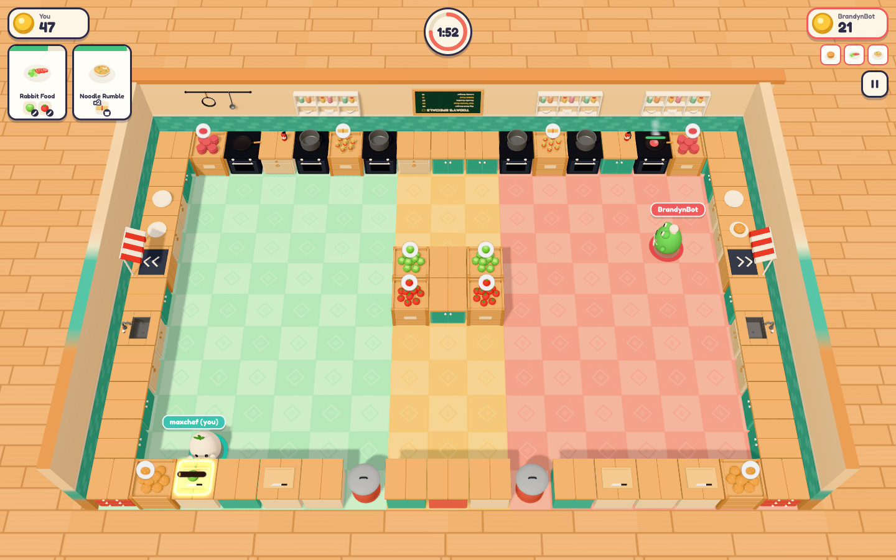
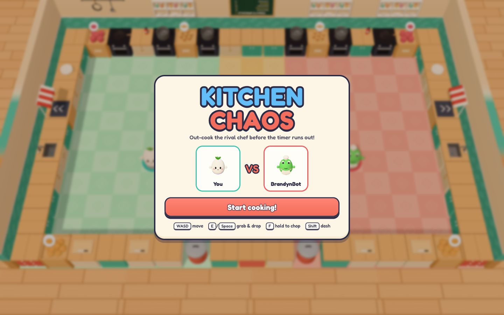
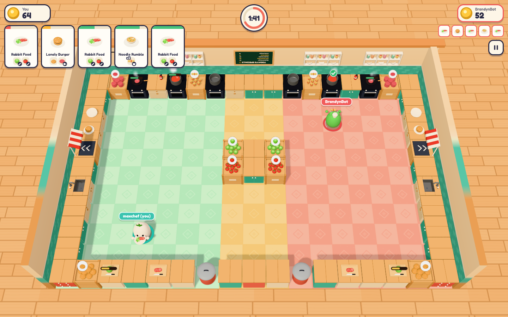
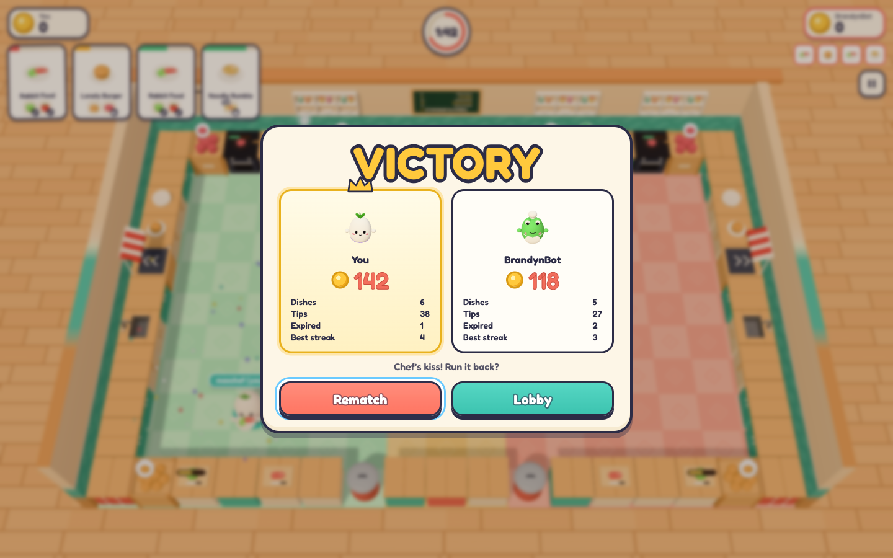
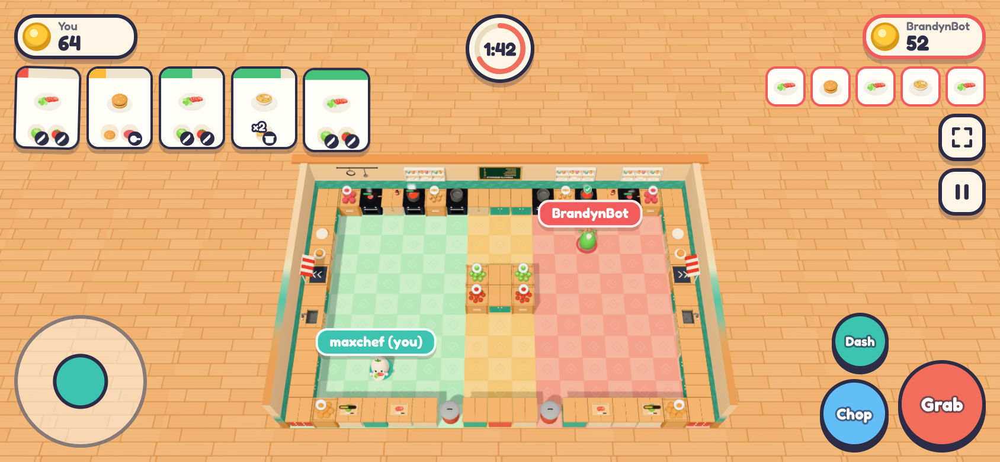
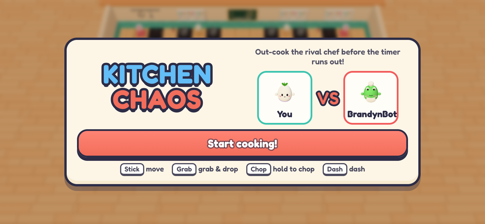
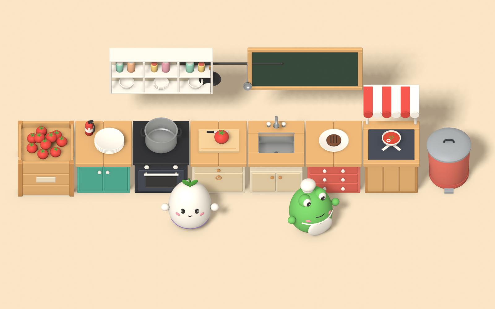

# Kitchen Chaos

**[Jogar agora no navegador](https://douglastaquary.github.io/kitchen-chaos/)**

Demo de um jogo de cozinha no estilo *Overcooked*, feito para rodar direto no navegador. Você e o chef rival **BrandynBot** (uma IA) dividem uma cozinha espelhada e disputam quem serve mais pratos antes do relógio zerar. Ganha quem terminar com mais moedas.



## Telas

| Tela inicial | Cozinha cheia |
| --- | --- |
|  |  |

| Fim de partida | Celular em paisagem |
| --- | --- |
|  |  |

| Tela inicial no celular |
| --- |
|  |

## Como jogar

### Objetivo

A partida dura **2 minutos e 30 segundos**. Os pedidos aparecem como tickets no canto superior esquerdo. Prepare cada prato, entregue na janela listrada do seu lado da cozinha e junte moedas. Quando o relógio zerar, quem tiver mais moedas vence.

### Controles

| Ação | Teclado | Celular |
| --- | --- | --- |
| Andar | `WASD` ou setas | analógico na esquerda |
| Pegar, largar e combinar | `E`, `Espaço`, `J` ou `Enter` | botão **Grab** |
| Picar (segure) | `F`, `K` ou `Ctrl` | botão **Chop** |
| Dash (arrancada) | `Shift` ou `L` | botão **Dash** |
| Pausar | `Esc` ou `P` | botão ⏸ |

O chef sempre interage com a bancada para a qual está virado, que fica destacada com um brilho.

**No celular** o jogo roda em modo paisagem: ao tocar em *Start cooking!* ele entra em tela cheia e, no Android, trava a orientação. Com o celular em pé, aparece um aviso para girar, e a partida fica pausada. No iPhone, o Safari não permite tela cheia em páginas, então use **Compartilhar → Adicionar à Tela de Início** e abra o jogo pelo ícone. Ele abre em tela cheia e em paisagem.

### A cozinha

- **Metade verde (esquerda):** a sua cozinha. Metade vermelha (direita): a do BrandynBot. Você não pode usar as estações do rival, e o jogo avisa com *"Not your kitchen!"*.
- **Ilha amarela (centro):** caixotes de alface e tomate compartilhados pelos dois chefs.
- **Parede do fundo:** caixotes de carne e macarrão, frigideiras e panelas.
- **Laterais:** pilha de pratos, janela de entrega (com toldo listrado) e pia, que funciona como bancada extra.
- **Fileira da frente:** caixote de pães, tábuas de corte e lixeira.

### Preparando os ingredientes

| Ingrediente | Onde conseguir | Como preparar |
| --- | --- | --- |
| Alface | ilha central | coloque na tábua e segure **Picar** por cerca de 1,8 s |
| Tomate | ilha central | coloque na tábua e segure **Picar** por cerca de 1,5 s |
| Carne | caixote do fundo | coloque na frigideira; fica pronta em 6,5 s |
| Macarrão | caixote do fundo | coloque 2 na panela; cozinha em 7 s |
| Pão | caixote da frente | já vai direto para o prato |

Picar só avança enquanto você segura o botão. Frigideiras e panelas cozinham sozinhas, então aproveite esse tempo para fazer outra coisa.

### Montando e entregando

1. Pegue um **prato** na pilha.
2. Junte os ingredientes prontos nele. Dá para levar o prato até o ingrediente ou o ingrediente até o prato apoiado numa bancada. Com o prato na mão, também dá para pegar o pão direto do caixote e a carne direto da frigideira.
3. Sopa e macarrão saem da panela: chegue com um **prato vazio** quando o cozimento terminar.
4. Leve o prato à **janela de entrega**. Ele é aceito se combinar com qualquer ticket aberto, não precisa ser o primeiro da fila.

O jogo só deixa colocar no prato combinações que existem no cardápio, então não tem como montar um prato impossível por engano.

### Cardápio do dia

| Prato | Ingredientes | Moedas | Tempo do ticket |
| --- | --- | --- | --- |
| Big Bonk Burger | pão + carne frita + alface picada + tomate picado | 30 | 80 s |
| Sad Tomato Soup | 3 tomates picados cozidos na panela (8 s) | 20 | 70 s |
| Noodle Rumble | 2 macarrões cozidos na panela (7 s) | 24 | 66 s |
| Rabbit Food | alface picada + tomate picado | 16 | 58 s |
| Lonely Burger | pão + carne frita | 18 | 62 s |

### Pontuação

- **Valor do prato:** as moedas da tabela acima.
- **Gorjeta:** até **+10** moedas, proporcional ao tempo que ainda restava no ticket. Quanto mais rápido, maior.
- **Sequência:** cada entrega seguida sem deixar ticket expirar soma **+2** de bônus na próxima (até +10).
- **Ticket expirado:** perde **5 moedas** e zera a sequência.

### Cuidado com o fogo

- Quando a comida fica pronta, aparece um ✔ verde e toca um sino.
- Se ficar esquecida, um **!** vermelho pisca com alarme e fumaça cerca de 4 s antes de queimar.
- A carne queima 9 s depois de ficar pronta; sopa e macarrão, 11 s depois.
- Comida queimada vai para a **lixeira**. Panela queimada é esvaziada interagindo com ela de mãos vazias.

### Ritmo da partida

- Os dois primeiros pedidos são fáceis (Rabbit Food e Lonely Burger), e o próximo só chega aos 20 s.
- Depois dos 30 s entram os pratos mais difíceis, e os pedidos passam a vir cada vez mais rápido.
- Cabem no máximo 5 tickets na tela.
- Você e o BrandynBot recebem **exatamente a mesma sequência de pedidos**, então a disputa é justa.

### Dicas

- Coloque a carne na frigideira e vá picar enquanto ela frita.
- Deixe um prato esperando numa bancada perto da janela e vá montando nele.
- Olhe a barra de tempo dos tickets: entregar o que está quase expirando evita perder 5 moedas e a sequência.
- O dash ajuda a atravessar a cozinha, mas tem uma pequena recarga.
- O BrandynBot anda e pica um pouco mais devagar que você e demora alguns décimos de segundo para reagir. Aproveite, porque ele não esquece panela no fogo.

## Curiosidades da criação



- **Nenhum modelo foi desenhado à mão.** Chefs, fogões, panelas, caixotes, ingredientes e decoração saem de um único script Python ([`blender/build_assets.py`](blender/build_assets.py)) que roda o Blender sem interface e exporta tudo num arquivo `kitchen.glb` de 1,5 MB. São 37 modelos, cerca de 56 mil triângulos e nenhuma textura: as cores vêm só dos materiais.
- **A arte seguiu imagens de referência** com uma cozinha pastel, piso xadrez em verde-menta, amarelo e coral, azulejos turquesa e chefs-bolinha fofos. O nabo branco e o sapo verde vieram direto dessas referências. O nome do rival, BrandynBot, é uma homenagem ao jogador "BrandynShips" que aparecia nelas.
- **Os ícones dos tickets são fotos dos próprios modelos 3D.** Ao carregar, um segundo renderizador fotografa cada prato e ingrediente, e essas imagens viram os ícones do HUD. Se um modelo mudar, os ícones mudam junto.
- **Não há nenhum arquivo de áudio.** Todos os efeitos (chiado da frigideira, faca, sino, alarme) e a música de fundo são sintetizados em tempo real com a Web Audio API.
- **O quadro-negro "Today's Specials" é desenhado por código** a partir da mesma tabela de receitas do jogo. Na primeira versão o texto aparecia espelhado, porque o plano do quadro estava virado ao contrário.
- **O BrandynBot não trapaceia.** Ele planeja qual pedido fazer, acha o caminho pela cozinha com busca em largura (BFS) e envia os mesmos comandos de "andar", "pegar" e "picar" que o teclado envia para o seu chef. O mesmo cérebro, ligado ao seu chef com `?autoplay`, joga partidas inteiras sozinho nos testes automáticos.
- **Otimização:** a cozinha começou com 426 chamadas de desenho por quadro. Juntando as peças estáticas por material, caiu para cerca de 80, e o jogo ainda reduz a resolução sozinho se o FPS cair.
- **A câmera se ajusta sozinha** ao formato da tela, do monitor ultrawide ao celular em pé, para que a cozinha inteira, incluindo as tábuas da fileira da frente, sempre fique visível abaixo do HUD. Numa das primeiras versões, um sinal trocado na conta mandava a câmera para 78 unidades de distância.
- **Os testes rodam num Chrome de verdade, fora da tela.** No modo headless o Chrome usa renderização por software e o jogo caía para 3 FPS, então os scripts de playtest abrem uma janela real posicionada fora do monitor.
- Todo o projeto, do design ao deploy, foi construído por um agente de IA no Cursor, usando skills de desenvolvimento de jogos em Three.js junto com o Blender.

## Tecnologia

- **Three.js** (r184) + **TypeScript** + **Vite 6**
- **Blender** 2.9+ para gerar os modelos (script `bpy`)
- **Web Audio API** para som e música
- **Playwright** para playtests automáticos
- **GitHub Actions + GitHub Pages** para publicar

## Desenvolvimento

```bash
npm install
npm run dev          # http://127.0.0.1:5188
npm run build        # gera dist/
npm run preview      # testa o build de produção em http://127.0.0.1:4188
```

- `?debug` abre um painel para ajustar a velocidade, o bot e a exposição.
- `?autoplay` faz a IA controlar o seu chef.
- `npm run playtest:bot` joga uma partida inteira em autoplay e grava métricas em `artifacts/full-match/`.
- `node scripts/readme-shots.mjs` recaptura as imagens deste README em `docs/screenshots/`.

### Regenerar os modelos 3D

```bash
npm run assets       # roda blender/build_assets.py e gera public/assets/kitchen.glb
node blender/list_glb.mjs
```

Requer o Blender 2.9+ em `/Applications/Blender.app` (em outros sistemas, ajuste o caminho no `package.json`).

## Publicação

Cada push na branch `main` dispara o workflow [`.github/workflows/deploy.yml`](.github/workflows/deploy.yml), que gera o build e publica em [douglastaquary.github.io/kitchen-chaos](https://douglastaquary.github.io/kitchen-chaos/). O `base: './'` do Vite faz o jogo funcionar dentro do subcaminho do repositório.

## Estrutura

```text
blender/          script de modelagem procedural (bpy) e inspetor do GLB
public/assets/    kitchen.glb exportado pelo Blender
src/game/         layout, estações, receitas, pedidos, chef, IA do bot e orquestração
src/assets/       carregamento do GLB, visuais dos itens, ícones e texturas procedurais
src/systems/      HUD, áudio, efeitos visuais e debug
scripts/          playtests e capturas com Playwright
docs/screenshots/ imagens deste README
```
